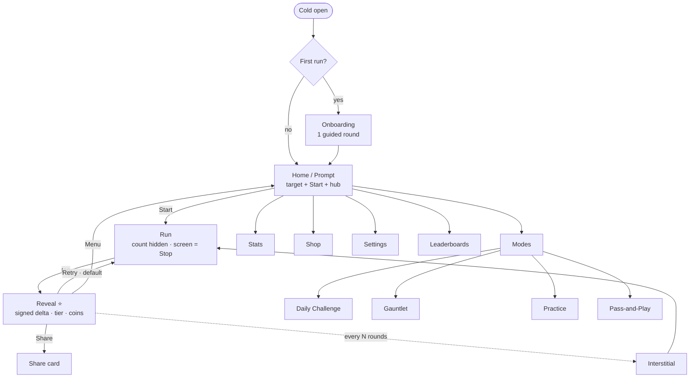

# Off By — Design Spec (Structure & Flows)

| | |
|---|---|
| **Companion to** | [PRD](./PRD.md) — the product "what" and "why" |
| **This doc** | The structural skeleton for design: navigation model, screen inventory, flows. The *"where things live."* |
| **Out of scope** | Visual / art direction (explore in Figma); core-loop behaviour (see [PRD §6](./PRD.md)); per-screen pixel detail |
| **Status** | Draft v0.1 |
| **Owner** | _TBD_ |
| **Last updated** | 2026-06-09 |

---

## 1. Navigation model — the decide-once call

**Home-as-launchpad, hub-and-spoke. No persistent tab bar.**

- Cold-open lands on **Home, which *is* the Classic Prompt** — the target and a thumb-sized **Start** are right there, so app-open to first round is effectively one tap (the "instant play" promise, [PRD §10](./PRD.md)).
- Everything else (modes, stats, shop, settings, leaderboards) hangs off Home as **thumb-reachable affordances**, not a nav bar. A persistent bottom nav adds chrome the loop doesn't want and fights the "whole screen is the tap target" rule.
- **Play surfaces (Run / Reveal) are full-bleed and chrome-free.** You leave the loop only via **Menu** on Reveal; the *default* Reveal action is **Retry**, which stays in the loop.

This is the highest-leverage structural decision — it shapes every frame. Confirm it before drawing (see §5).

---

## 2. Screen inventory & content checklist

> One row per screen. "Key contents" is a checklist, not a layout — layout is Figma's job.

### P0 — MVP (the loop + minimum frame)

| Screen | Purpose & key contents | PRD |
|---|---|---|
| **Onboarding** *(first run only)* | One guided Classic round, no text walls; teaches tap-start / tap-stop; flows straight into Home | [§6](./PRD.md), F-8 |
| **Home / Prompt** | Cold-open target; thumb **Start**; streak + daily nudge; affordances to modes / stats / shop / settings | [§6](./PRD.md), [§10](./PRD.md), F-1 |
| **Round** *(Run + Guess)* | Full-bleed; elapsed count **hidden**; whole screen = **Stop**; neutral ambient only | [§6](./PRD.md), F-2, F-3 |
| **Reveal** ⭐ | Showpiece: **signed delta** (hero, 2-dec), player time, target, tier badge + scaled juice, coins; **Retry** (default) / Share / Menu | [§6](./PRD.md), [§9.1](./PRD.md), F-4–F-6 |
| **Stats** *(min)* | Best + **signed bias**; full closeness/bias/consistency trends land in P1 | F-7, F-10 |
| **Settings** *(min)* | Toggle haptics / sound / distraction; reset stats; notifications; restore purchases | [§10](./PRD.md) |
| *Interstitial* *(placement, not a screen)* | Count-gated; **never** between a near-miss and its Retry | [§9.3](./PRD.md) |

### P1 — retention, social, monetization

| Screen | Purpose & key contents | PRD |
|---|---|---|
| **Modes hub** | Entry to non-default modes from Home | [§7](./PRD.md) |
| **Daily Challenge** | Seeded target; one scored attempt + unlimited practice; result as **percentile**; streak | [§7](./PRD.md), F-9 |
| **Practice** | Round variant: live bias/consistency + coaching nudge; unscored, no coins | [§7](./PRD.md), F-10b |
| **Gauntlet** | Escalating rounds; run-progress HUD; **end screen** with score | [§7](./PRD.md), F-12 |
| **Pass-and-Play** | Setup (players/names) → turn manager → **winner screen**; offline | [§7](./PRD.md), F-17 |
| **Share card** | Auto-generated image: your time vs target, off by X | F-14 |
| **Challenge-a-friend** | Share seed link → friend plays the same round → compare | F-15 |
| **Leaderboards** | Daily (banded → percentile) + all-time "closest hit" framed as **vanity, not rank** | [§11.3](./PRD.md), F-16 |
| **Shop** | Cosmetics: button skins, themes, haptic patterns, sound packs | [§9](./PRD.md), F-20 |
| **Store** | Remove-ads IAP, coin packs, cosmetic bundles; restore | [§9.3](./PRD.md), F-21 |
| **Goals & streak** | Daily/weekly goals; streak + freeze status — likely a **Home panel**, not a full screen | F-11, F-11b |

### P2 — later

| Screen | Purpose & key contents | PRD |
|---|---|---|
| **Blindfold** | Round variant: blank screen, no cues | [§7](./PRD.md) |
| **Friends / social** | Social graph | F-18 |
| **Live events** | Seasonal / event surface | [§14](./PRD.md) |

**Most "modes" are the *Round* surface re-parameterised, not new screens** — this keeps the real screen count far below the mode count:

- *Pure Round variants* (different Run feedback/config only): **Practice**, **Distraction** *(P1)*, **Blindfold** *(P2)*.
- *Round + one results/orchestration screen*: **Gauntlet** (end screen), **Daily** (percentile result), **Pass-and-Play** (turn manager + winner).
- **Classic** is the baseline Round, reachable straight from Home.

Design the Round + Reveal once, cleanly parameterised, and most modes fall out of it.

---

## 3. Core loop — start design here

One surface, four states ([PRD §6](./PRD.md)). This is where most of the design love goes; everything else is supporting chrome.

| State | Lives on | What's on screen |
|---|---|---|
| **Prompt** | Home | Target time (big), **Start** (thumb zone), streak / daily nudge |
| **Run** | Round | **Nothing that reveals elapsed time.** Neutral ambient only; whole screen is the Stop target |
| **Guess** | Round | The Stop tap — captured at the input event ([PRD §11.1](./PRD.md)); a transition, not a screen |
| **Reveal** | Reveal | Signed delta (hero), player time, target, tier badge, coins; juice scaled to tier; **Retry / Share / Menu** |

Reveal → Retry → Run must be near-instantaneous — protect it from any interstitial ([PRD §6](./PRD.md)).

---

## 4. Primary flow

The interstitial edge is **count-gated** and never fires on the near-miss → Retry beat ([PRD §9.3](./PRD.md)).

---

## 5. Open IA questions *(confirm before / early in Figma)*

- **Nav model** — Home-as-launchpad hub-and-spoke (assumed) vs. a persistent bottom nav. Affects every frame; lock first.
- **Cold-open** — land on Home-as-Prompt (assumed, one tap to play) vs. straight into a live round (zero taps, but no hub on screen).
- **Modes hub** — full screen vs. a swipe/carousel on Home.
- **Goals & streak** — Home panel vs. dedicated screen.
- **Practice entry** — its own tile vs. a "warm-up" inside the Daily Challenge.
